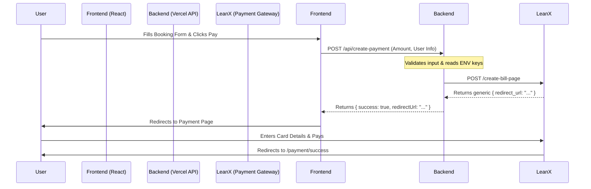

# Lean.x Payment Gateway Integration Guide

This document explains how the **Lean.x Payment Gateway** is integrated into the One X Home Booking platform.

## 1. Overview
The integration follows a standard **Redirect Model**:
1.  **Frontend:** Collects booking details.
2.  **Backend (API):** Requests a payment URL from Lean.x.
3.  **Redirect:** User is sent to the Lean.x payment page (`payment.leanx.io`).
4.  **Completion:** User pays and is redirected back to our success page.

---

## 2. Configuration (`.env`)
The system requires 3 environment variables to function. These must be set in **Vercel** (for Production) and your local `.env` file.

| Variable | Description | Value (Production) |
| :--- | :--- | :--- |
| `LEANX_API_HOST` | The API Endpoint URL | `https://api.leanx.io` |
| `LEANX_AUTH_TOKEN` | Your Merchant Secret Token | `LP-C64B42C3...` |
| `LEANX_COLLECTION_UUID` | ID of the specific collection | `Dc-E5317E6652-Lx` |

> **Context:** Initially, the documentation pointed to `api.leanx.dev`, which caused `INVALID_UUID` errors. We verified that `api.leanx.io` is the correct host for live accounts.

---

## 3. Code Structure

### A. Backend: `api/create-payment.ts`
This is a Serverless Function that acts as the secure bridge between our app and Lean.x.

**What it does:**
1.  Receives customer details (Name, Email, Amount) from the Frontend.
2.  Validates the input (checks for valid email, phone, positive amount).
3.  Constructs the payload:
    *   **`redirect_url`**: Dynamic URL based on current host (`https://boox.vercel.app/payment/success`).
    *   **`callback_url`**: Where Lean.x sends the receipt (`/api/payment-webhook`).
4.  Sends a `POST` request to `${LEANX_API_HOST}/api/v1/merchant/create-bill-page`.
5.  Returns the `redirect_url` to the frontend.

### B. Frontend: `src/components/booking/BookingForm.tsx`
Handles the user interaction.

**Flow:**
1.  User clicks "Pay & Book".
2.  Calls `/api/create-payment`.
3.  Receives the `redirectUrl` from the backend.
4.  Executes `window.location.href = data.redirectUrl` to send the user to Lean.x.

---

## 4. Payment Flow Diagram

---

## 5. Troubleshooting

### `INVALID_UUID` Error / Code 5699
*   **Cause:** Mismatch between the API Host and the Credentials.
*   **Fix:** Ensure you are using `api.leanx.io` (Production) with the One X credentials. `api.leanx.dev` is invalid for these keys.

### Payment Page Shows Wrong Amount
*   **Cause:** The amount is sent dynamically from the code.
*   **Fix:** Check `api/create-payment.ts` or `src/components/booking/BookingForm.tsx` to verify the `amount` value being sent. (Currently set to `0.20` for testing).

### `ENOTFOUND` Error
*   **Cause:** The API Host URL is typed incorrectly.
*   **Fix:** Check `LEANX_API_HOST` in `.env`.
