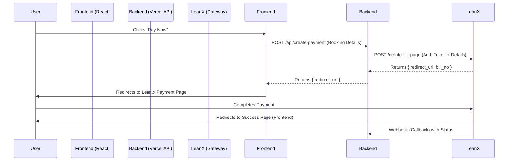

# Lean.x Payment Gateway Integration Guide

## 1. Overview
This document outlines the integration strategy for the **Lean.x Payment Gateway** into the One X Home Booking system. The integration uses a **Serverless Backend (Vercel Functions)** approach to secure sensitive credentials (API Keys, Hash Keys) and prevent them from being exposed to the client-side.

## 2. Architecture
The integration follows a "Redirect" flow where the user is redirected to a secure Lean.x payment page to complete the transaction.



## 3. Credentials & Configuration
**Important:** Never commit actual keys to GitHub. Use Environment Variables.

| Variable Name | Description | Source |
|--------------|-------------|--------|
| `LEANX_AUTH_TOKEN` | The main authentication token for API requests. | `Lean.x API.txt` |
| `LEANX_COLLECTION_UUID` | Unique ID for the merchant collection. | `Lean.x API.txt` |
| `LEANX_HASH_KEY` | Key used for signature generation (if required later). | `Lean.x API.txt` |
| `LEANX_API_URL` | Base URL for the API. | `https://api.leanx.dev/api/v1` |

## 4. API Endpoints Implementation

### A. Create Payment Page (The "Checkout" Action)
*   **Endpoint:** `/merchant/create-bill-page`
*   **Method:** `POST`
*   **Purpose:** Generates the payment link.
*   **Required Headers:**
    *   `auth-token`: `process.env.LEANX_AUTH_TOKEN`
*   **Required Body:**
    ```json
    {
      "collection_uuid": "process.env.LEANX_COLLECTION_UUID",
      "amount": 150.00,
      "invoice_ref": "BOOKING-123",
      "redirect_url": "https://your-app.vercel.app/payment/success",
      "callback_url": "https://your-app.vercel.app/api/payment-webhook",
      "full_name": "Customer Name",
      "email": "customer@email.com",
      "phone_number": "0123456789"
    }
    ```

### B. List Payment Services (Optional - for displaying bank icons)
*   **Endpoint:** `/merchant/list-payment-services`
*   **Method:** `POST`
*   **Body:**
    ```json
    {
      "payment_type": "WEB_PAYMENT",
      "payment_status": "active",
      "payment_model_reference_id": 1
    }
    ```

### C. Check Transaction Status (Verification)
*   **Endpoint:** `/merchant/manual-checking-transaction`
*   **Method:** `POST`
*   **Query Param:** `?invoice_no=BOOKING-123`

## 5. Implementation Steps

### Step 1: Environment Setup (CRITICAL)

#### A. Local Development (.env file)
Your `.env` file should already have these added:
```env
LEANX_AUTH_TOKEN=LP-C64B42C3-MM|dc09cd86-6311-4730-8819-55bba6736620|e68bd67be0597380af9a9c5bcad53b36425308575a6e009f78416d46254fbcd5382494c4bdba79af3ebc3f5b206c333efb1d62852abfd04b48b0ad74a53593ca
LEANX_COLLECTION_UUID=Dc-E5317E6652-Lx
LEANX_HASH_KEY=e68bd67be0597380af9a9c5bcad53b36425308575a6e009f78416d46254fbcd5382494c4bdba79af3ebc3f5b206c333efb1d62852abfd04b48b0ad74a53593ca
```

#### B. Production (Vercel Dashboard)
**IMPORTANT:** You must add these to Vercel Environment Variables:

1. Go to your Vercel project dashboard
2. Navigate to **Settings** → **Environment Variables**
3. Add each variable:
   - `LEANX_AUTH_TOKEN` = (paste the full token)
   - `LEANX_COLLECTION_UUID` = `Dc-E5317E6652-Lx`
   - `LEANX_HASH_KEY` = (paste the full hash key)

4. **For Firebase Admin (Webhook)**, also add:
   - `FIREBASE_ADMIN_PRIVATE_KEY` = (Get from Firebase Console → Project Settings → Service Accounts → Generate New Private Key)
   - `FIREBASE_ADMIN_CLIENT_EMAIL` = (From the same JSON file)

5. Set scope to **All** (Production, Preview, Development)
6. Click **Save**
7. **Redeploy** your application for changes to take effect

### Step 2: Backend APIs (✅ Already Created)
The following API routes are ready:
- `api/create-payment.ts` - Creates Lean.x payment session
- `api/payment-webhook.ts` - Receives payment confirmation from Lean.x
- `api/check-payment-status.ts` - Manually checks transaction status

### Step 3: Frontend Integration (✅ Already Implemented)
- `BookingForm.tsx` - Integrated with `/api/create-payment`
- `PaymentSuccess.tsx` - Verifies payment and shows status

### Step 4: Testing the Flow

#### A. Test Locally (Development)
1. Run `npm run dev`
2. Create a booking
3. **Important:** Lean.x will redirect to `localhost:5173/payment/success`
4. Check the webhook logs (you may need to use ngrok or similar for local webhook testing)

#### B. Test on Production
1. Deploy to Vercel: `git push`
2. Create a test booking on your live site
3. Complete payment on Lean.x page
4. Verify redirect works to `your-domain.vercel.app/payment/success`
5. Check Firestore to confirm booking status updated to `confirmed`

## 6. Security Checklist
- [x] **Never** expose `LEANX_AUTH_TOKEN` in React code (it's only in server-side API routes)
- [x] Always validate the `amount` on the server side (done in `create-payment.ts`)
- [x] Use HTTPS for all callback URLs (Vercel provides this automatically)
- [ ] Add Firebase Admin credentials to Vercel (Required for webhook)
- [ ] Test the complete payment flow end-to-end

## 7. Troubleshooting

### Issue: Payment redirects but webhook doesn't update Firestore
**Solution:** Ensure Firebase Admin credentials are set in Vercel Environment Variables.

### Issue: "Payment gateway not configured" error
**Solution:** Check that `LEANX_AUTH_TOKEN` and `LEANX_COLLECTION_UUID` are set in Vercel.

### Issue: Cannot verify payment on success page
**Solution:** The Lean.x redirect URL should include the `invoice_no` query parameter. Check their documentation or test the actual redirect.

## 8. Next Steps (Optional Enhancements)
- [ ] Add email notifications on successful payment
- [ ] Implement payment retry logic for failed transactions
- [ ] Add admin panel view for payment history
- [ ] Create automated refund system
